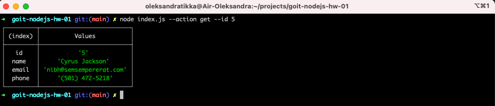
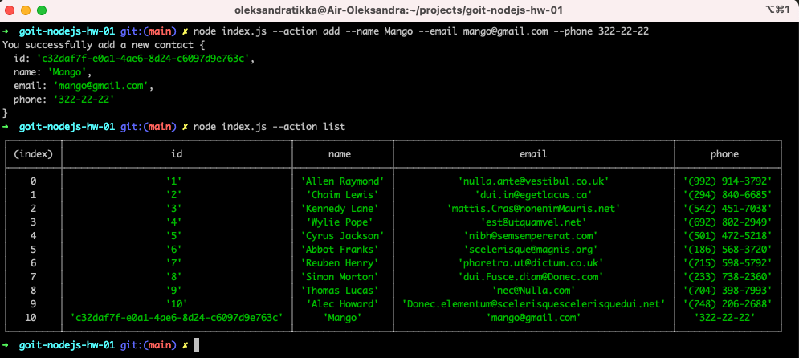
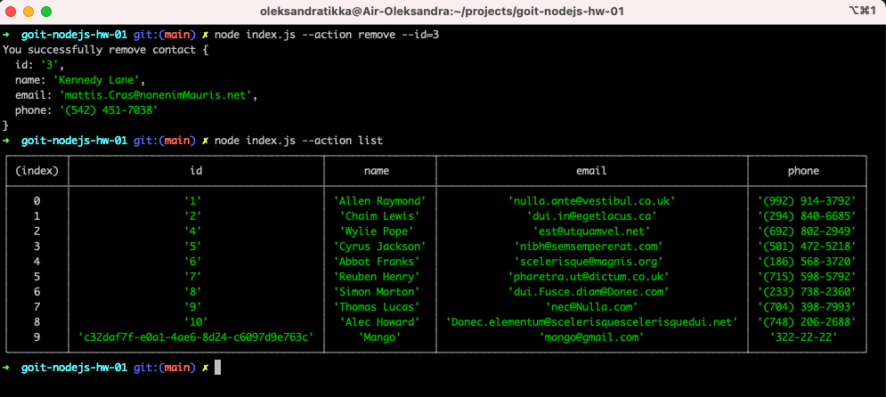

# goit-nodejs-hw-01

## Задание 1

 Получаем и выводим весь список контактов в виде таблицы (console.table)
```
node index.js --action list
```


## Задание 2

 Получаем контакт по id
```
node index.js --action get --id 5
```



## Задание 3

 Добавялем контакт
```
node index.js --action add --name Mango --email mango@gmail.com --phone 322-22-22
```



## Задание 4

 Удаляем контакт
```
node index.js --action remove --id=3
```

